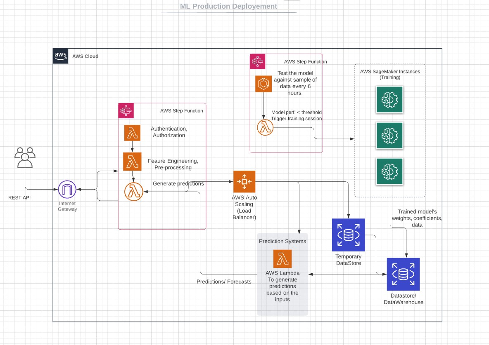

## Fasal Assignment

### Problem Statement 
    Create a web application to forecast temperature and humidity for an observation value (an integer) passed.

### Solution
    For creating a webserver, I have used FastAPI and deployed it on Heroku hosting service. The webserver setup follows
    a REST architecture. So, interaction with the server would be through API calls and this approach maintains low 
    coupling (less inter-dependece).
    
    Below are commands to run the output. Try using Postman or similar API testing tools if available with the following endpoints
    
- Humidity Forecast Endpoints:
    - https://microclimate-forecaster.herokuapp.com/predict/hum (POST)
    - https://microclimate-forecaster.herokuapp.com/predict/humidity (POST)
    
- Temperature Forecast Endpoints:
    - https://microclimate-forecaster.herokuapp.com/predict/temp (POST)
    - https://microclimate-forecaster.herokuapp.com/predict/temperature (POST)
  
- Request Body for both the above endpoints. Set the body data type to JSON
  - ``{
    "days": [78, 56, 123]
    }``
    
- Healthcheck Endpoint(To verify service availability)
    - https://microclimate-forecaster.herokuapp.com/healthcheck
    
In case any of above mentioned tools aren't available, grab a terminal any use the below commands. (Change the value in days key for other predictor values)
- Humidity Forecasts:
  - curl --location --request POST https://microclimate-forecaster.herokuapp.com/predict/hum --header "Content-Type: application/json" --data-raw "{\"days\": [78, 56, 123]}"
    
- Temperature Forecasts:
    - curl --location --request POST https://microclimate-forecaster.herokuapp.com/predict/temp --header "Content-Type: application/json" --data-raw "{\"days\": [78, 56, 123]}"
    
## Sample Input and Output
 - Case 1: Humidity Forecast for days 78, 56, 123
    - Input: 
      <pre>curl --location --request POST 'https://microclimate-forecaster.herokuapp.com/predict/hum' 
      --header 'Content-Type: application/json' 
      --data-raw '{"days": [78, 56, 123}'</pre>
    - Output: <pre>{
    "Forecast for day 78": "95.28432515260505 %", 
    "Forecast for day 56": "74.54445038164066 %",
    "Forecast for day 123": "234.79426241101882 %"
}</pre>
      
  - Case 2: Forecast for days 71, 72, 73, 74, 75
    -Input:
    <pre>curl --location --request POST 'https://microclimate-forecaster.herokuapp.com/predict/temp' \
      --header 'Content-Type: application/json'  --data-raw '{"days": [71,72, 73, 74, 75]}'</pre>
  - Output:
    <pre>{
    "Forecast for the day 71": "31.23092577200435 °C",
    "Forecast for the day 72": "31.178254480113758 °C",
    "Forecast for the day 73": "31.12704723648846 °C",
    "Forecast for the day 74": "31.077578343567207 °C",
    "Forecast for the day 75": "31.030126870201652 °C"
    }
    </pre>

## Questions
- ### If you have to set up a production server and deploy the application into that server, what approaches would you take? Please share a template design on how you will expose the model to the client, do load-balancing and what all factors need to be taken care of in order to productise your application.
   
  - The template design heavily uses existing AWS services to represent use-cases and requirements condensed. 
  - The clients and outer entities interact with the model through a REST API only. This provides a comfortable layer of abstraction in terms of security, authorization and authentication. RESTful Webservices also don't maintain state, so one client's usage will not affect the other in any way.
  - All the incoming API requests are authenticated and authorized to the resources they require. If all the previous was successful, then the input data is pre-processed, and a function is invoked to generate predictions.
  - The incoming data is also added to ephemeral datastore, which will further be synced to the main datastore/data warehouse after a time delta (say 6 hrs). This "new" data is further used for testing the model.
  - The model is tested using a sample mixture of previously trained data with the new data (should be backfilled with the predictions made by the model) and normalized to counter heavy influx of one type of data-class.
  - Based on the results of the tests done, if the model performance has decayed further actions would be taken. A more reliable test should be scheduled and if that test yields the similar results then a re-training would be scheduled. 
  - Load balancing is no longer much a tough "task". There are many services and open source solutions available that do load balancing pretty reliably that it is no longer a concern.
  - The feedback loops, logging, snap-shoting the progress of model training, data ingestion and assembling are also key factors that need to maintained, and are a bit harder to visualize.
- ### A model’s performance usually degrades over time. What is the reason for it?
  - A trained model's accuracy and performance as per expectations decays over time on par with how representative are the inputs to the model. This occurs due to a phenomenon called "concept drift".
  - `In predictive analytics and machine learning, the concept drift means that the statistical properties of the target variable, which the model is trying to predict, change over time in unforeseen ways. This causes problems because the predictions become less accurate as time passes (From Wikipedia).` 
  - When models are moved into "prod" environments they interact with data from real world. This also improves the likelihood of new data coming in contact with the model.
  - A typical solution would be to use new data as "forward-feedback" loops and re-train model, when a set threshold is met on the model's performance.
- ### In order to avoid model staleness or performance degradation, if we plan to automate the training pipeline, what will be your approach. Do not code this but share the design and different components. The training pipeline needs to be triggered every time the accuracy drops below a certain threshold and the pipeline will train and test model meeting certain metrics threshold (e.g., MSE less than or equal to 2 degree Celsius).
  - In the image above, I attempt to show an automated-pipeline for model re-training.
  - Using a mixture of data of previous data and newly collected data to test, test the model periodically. The time period will depend on the rate of incoming data. If model's performance is lower than the set threshold, it would have to go through another testing phase with a much larger sample (being as representative of the past+present data).
  - A periodic retraining schedule is a good starting point to figure out the rate of degradation and scope for improvement possible through re-training.
  - Points to note in this automatic training pipeline is to safeguard against huge drops (>8%) in short intervals. Whenever a new event/parameter influence over the whole incoming data increases significantly, even after re-training the model wouldn't improve is many aspects. In such cases, a better sub-strategy would be to deploy a "safe" model while collecting new training model and increase the dataset.
  - Most aspects of finding the best model for a dataset like feature engineering, model selection, error estimation & hyper-parameter tuning remain same for the re-training process. So, the new components here would be a new instance testing model performance, an ephemeral with new data and the original datastore.
- ### How would you integrate the training pipeline to the prediction application developed by you?
  - I would try to separate the training pipeline and prediction application as much as possible. Since, these are two different processes and need not communicate and rely on each other (atleast directly).
  - The only common point of contact for these two applications would be the datastores (ephemeral and central). This approach would make these two applications have low coupling and high cohesion as the principles of Software Engineering dictate.
  - The training pipeline (inital or re-training) is a periodically recurring event, so it's entrypoint would be from a `AWS Lambda` instance or `GCP Compute Engine` triggering the event once each period. 
  - While the prediction application is event driven (i.e. it kick-starts only if a client requests a prediction), so it would be using a notification or queue serivce (AWS SQS, Kafka) to understand someone requested a prediction for the given input. It's entrypoint is triggered by these type of event and then it follows a sequence of predefined steps and generates the prediction.
  - These applications co-exist on same space, but an error occurring on any side wouldn't necessarily disrupt stuff on the other side.
### References
1. https://www.kdnuggets.com/2019/12/ultimate-guide-model-retraining.html
2. https://machinelearningmastery.com/how-to-connect-model-input-data-with-predictions-for-machine-learning/
3. https://medium.com/analytics-and-data/overview-of-the-different-approaches-to-putting-machinelearning-ml-models-in-production-c699b34abf86
4. https://aws.amazon.com/sagemaker/